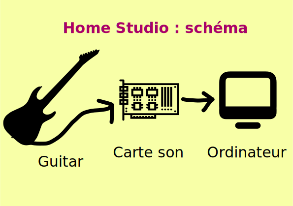

# Kata Home Studio

Aidez Babali à réaliser son album de metal (au passage on peut dire que c'est un album qu'on attend depuis un moment déjà).

Babali joue de la guitare (ou du clavier, mais ceci est plus rare, considérer le comme facultatif).

Procédure pour enregistrer du son :
- Il branche l'un de ses instrument à sa carte son.
- Il branche la carte son sur son PC

Babali a un problème et il doit déléguer le montage de ce setup à une équipe de techniciens.

Ecrire l'application qui leur permettrait de faire cette installation et de vérifier que tout fonctionne.

## KATA Console

Une version de la solution du kata en rust est sur ce repo

## Kata GUI

*Une version avec GUI est possible*